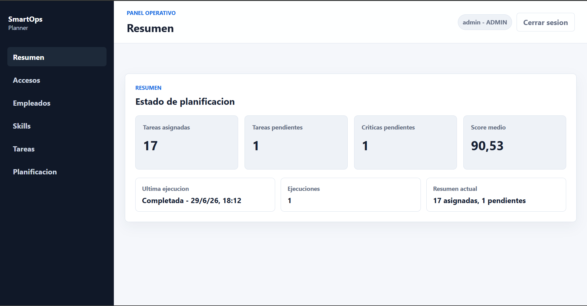
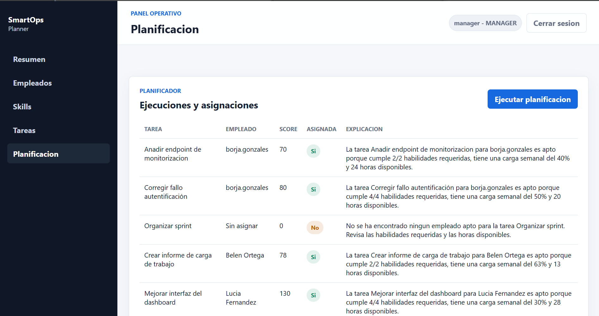
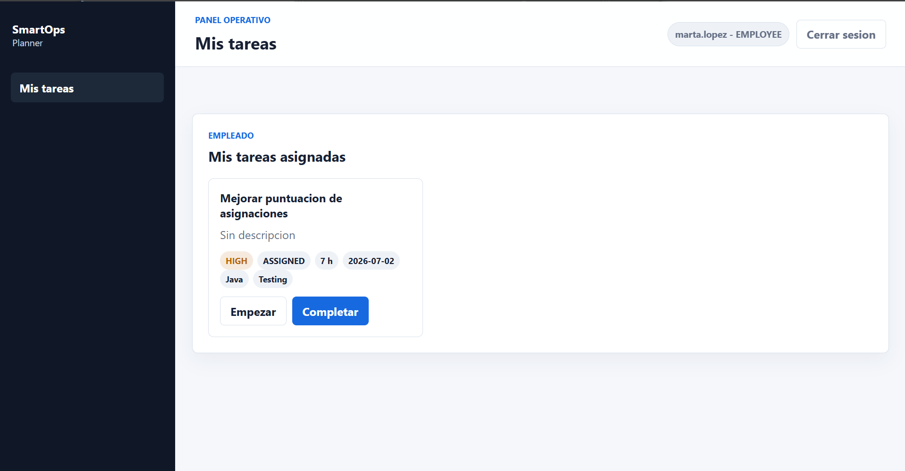

# SmartOps Planner

Aplicacion web con backend Spring Boot para planificacion operativa. Permite gestionar accesos, empleados, skills y tareas, ejecutar una planificacion automatica y consultar las tareas asignadas segun el rol del usuario.

El proyecto esta pensado como una simulacion de un entorno de trabajo real: un administrador crea accesos, los empleados tienen un perfil operativo con skills y disponibilidad, los usuarios con rol `MANAGER` crean tareas con requisitos y el sistema calcula asignaciones teniendo en cuenta skills, carga semanal, prioridad y fecha limite.



## Tecnologias

- Java 21
- Spring Boot 3.5
- Spring Security + JWT
- PostgreSQL
- Flyway
- Maven
- Docker / Docker Compose
- JUnit, Mockito, MockMvc y Testcontainers
- Swagger/OpenAPI

## Funcionalidades

- Login con JWT.
- Roles `ADMIN`, `MANAGER` y `EMPLOYEE`.
- Gestion de accesos de usuario.
- Creacion automatica del perfil de empleado al crear un acceso `EMPLOYEE`.
- Gestion de empleados, skills y tareas desde el panel.
- Edicion y eliminacion de skills y tareas.
- Planificacion automatica de tareas segun skills, carga de trabajo, prioridad y fecha limite.
- Asignaciones con puntuacion y explicacion.
- Documentacion del algoritmo de asignacion en `src/main/java/com/smartops/planner/planning/scoring-algorithm.md`.
- Vista de tareas propias para empleados, con cambio de estado.
- Panel operativo con resumen de planificacion.
- Interfaz web estatica servida por Spring Boot.
- Tests de servicios, controllers, seguridad e integracion.
- Dockerfile dividido en fase de construccion y fase de ejecucion.
- Docker Compose con PostgreSQL y app.
- GitHub Actions para CI, construccion de imagen Docker y despliegue continuo en Azure.

## Flujo Principal

1. El `ADMIN` crea accesos para usuarios `MANAGER` y `EMPLOYEE`.
2. Cuando se crea un acceso con rol `EMPLOYEE`, se genera tambien su perfil de empleado.
3. El `ADMIN` o `MANAGER` completa los datos operativos del empleado: nivel, horas disponibles y skills.
4. El `ADMIN` o `MANAGER` crea skills y tareas con prioridad, horas estimadas, fecha limite y skills requeridas.
5. Se ejecuta la planificacion para asignar tareas al empleado mas adecuado.
6. Cada `EMPLOYEE` entra en su panel, revisa sus tareas y puede marcarlas como `IN_PROGRESS` o `DONE`.
7. El panel de resumen muestra el estado general de la planificacion.



## Roles

| Rol | Puede hacer |
|---|---|
| `ADMIN` | Accesos, empleados, skills, tareas, resumen y planificacion |
| `MANAGER` | Empleados, skills, tareas, resumen y planificacion |
| `EMPLOYEE` | Ver sus tareas asignadas y cambiar su estado |



## Usuarios Demo

Solo se cargan con el perfil `dev`.

| Usuario | Rol | Password |
|---|---|---|
| `admin` | `ADMIN` | `password123` |
| `manager` | `MANAGER` | `password123` |
| `employee` | `EMPLOYEE` | `password123` |
| `laura.sanchez` | `MANAGER` | `password123` |
| `miguel.torres` | `MANAGER` | `password123` |
| `ana.garcia` | `EMPLOYEE` | `password123` |
| `carlos.martin` | `EMPLOYEE` | `password123` |
| `marta.lopez` | `EMPLOYEE` | `password123` |

## Ejecutar En Local

### Opcion recomendada para desarrollar

Levanta solo PostgreSQL con Docker y ejecuta la app con Maven:

```powershell
docker compose up -d postgres
mvn spring-boot:run "-Dspring-boot.run.profiles=dev"
```

Abrir:

```text
http://localhost:8080
```

### Probar todo con Docker Compose

```powershell
copy .env.example .env
docker compose --profile app up --build
```

Abrir:

```text
http://localhost:8080
```

Comprobar que la app responde:

```powershell
curl http://localhost:8080/api/health
```

Debe devolver:

```text
OK
```

Parar:

```powershell
docker compose --profile app down
```

Borrar tambien la base de datos:

```powershell
docker compose --profile app down -v
```

## Docker

Archivos principales:

```text
Dockerfile
docker-compose.yml
.dockerignore
.env.example
```

El `Dockerfile` construye la app en dos fases:

- fase de construccion: Maven + Java 21
- fase de ejecucion: JRE ligero para ejecutar el `.jar`

`docker-compose.yml` puede levantar:

- `postgres`
- `app` + `postgres` usando `--profile app`

Los servicios tienen comprobaciones de estado:

- PostgreSQL usa `pg_isready`
- la app usa `/api/health`

La configuracion local parte de `.env.example`, que documenta las variables necesarias para ejecutar la aplicacion con Docker Compose.

## Seguridad

- `POST /api/auth/login` es publico.
- `POST /api/auth/register` requiere `ADMIN`.
- `/api/users/**` requiere `ADMIN`.
- `/api/employees/**`, `/api/skills/**`, `/api/tasks/**`, `/api/planning/**` y `/api/dashboard/**` requieren `ADMIN` o `MANAGER`.
- `/api/my-tasks/**` requiere `EMPLOYEE`.
- Las passwords se guardan con BCrypt.
- La API usa JWT con:

```http
Authorization: Bearer TOKEN
```

El secreto JWT se configura con:

```text
APP_SECURITY_JWT_SECRET
```

Para crear el primer administrador en una base de datos nueva se pueden usar:

```text
APP_INITIAL_ADMIN_USERNAME
APP_INITIAL_ADMIN_PASSWORD
```

Estas variables son opcionales. Si no existen, la aplicacion no crea ningun usuario automaticamente. En local, los usuarios demo se cargan solo con el perfil `dev`.

## Endpoints Principales

| Metodo | Endpoint | Descripcion |
|---|---|---|
| `POST` | `/api/auth/login` | Login |
| `GET` | `/api/users` | Listar usuarios |
| `POST` | `/api/users` | Crear acceso de usuario |
| `GET` | `/api/employees` | Listar empleados |
| `PUT` | `/api/employees/{id}` | Actualizar perfil operativo de empleado |
| `GET` | `/api/skills` | Listar skills |
| `POST` | `/api/skills` | Crear skill |
| `DELETE` | `/api/skills/{id}` | Eliminar skill |
| `GET` | `/api/tasks` | Listar tareas |
| `POST` | `/api/tasks` | Crear tarea |
| `PUT` | `/api/tasks/{id}` | Actualizar tarea |
| `DELETE` | `/api/tasks/{id}` | Eliminar tarea |
| `PATCH` | `/api/tasks/{id}/status` | Cambiar estado |
| `POST` | `/api/planning/run` | Ejecutar planificacion |
| `GET` | `/api/planning/assignments` | Ver asignaciones |
| `GET` | `/api/dashboard/planning-summary` | Resumen |
| `GET` | `/api/my-tasks` | Mis tareas |
| `PATCH` | `/api/my-tasks/{id}/status` | Cambiar estado de mi tarea |

Swagger:

```text
http://localhost:8080/swagger-ui.html
```

La documentacion de la API se genera automaticamente con OpenAPI y se puede consultar desde Swagger UI.

## Tests

```powershell
mvn clean test
```

Tests concretos:

```powershell
mvn "-Dtest=SecurityAuthorizationTest,SecurityIntegrationTest" test
mvn "-Dtest=PlanningServiceTest,PlanningIntegrationTest" test
```

Los tests de integracion usan Testcontainers, asi que necesitan Docker Desktop arrancado.

## GitHub Actions

Workflows:

| Workflow | Archivo | Hace |
|---|---|---|
| `CI` | `.github/workflows/tests.yml` | Tests y generacion del JAR |
| `Docker` | `.github/workflows/docker-build.yml` | Construccion y publicacion de la imagen Docker, mas despliegue en Azure Container Apps |
| `Smoke Test` | `.github/workflows/smoke-test.yml` | Comprueba que la aplicacion desplegada en Azure responde |

El workflow de Docker publica la imagen en Docker Hub si estan configurados estos GitHub Secrets:

```text
DOCKERHUB_USERNAME
DOCKERHUB_TOKEN
```

Para el despliegue continuo en Azure tambien necesita:

```text
AZURE_CLIENT_ID
AZURE_TENANT_ID
AZURE_SUBSCRIPTION_ID
AZURE_RESOURCE_GROUP
```

El despliegue continuo esta configurado para que GitHub Actions pueda actualizar la Container App de Azure automaticamente. Para ello se usa una identidad de Azure asociada al repositorio mediante OIDC. En cada push a `main`, el workflow:

1. Construye la imagen Docker.
2. Publica la imagen en Docker Hub con tag `latest` y con el hash del commit.
3. Hace login en Azure con `azure/login`.
4. Actualiza la Container App para usar la imagen generada en ese commit.

Cuando el workflow `Docker` termina correctamente, se ejecuta el workflow `Smoke Test`. Este workflow hace una comprobacion HTTP contra la URL publica de Azure y valida que `/api/health` responde `OK`.

El workflow `Smoke Test` tambien se puede lanzar manualmente desde la pestana `Actions` de GitHub.

Los cambios de documentacion (`README.md` y otros `.md`) no disparan el despliegue, porque los workflows tienen `paths-ignore` para archivos Markdown.

## Despliegue En Azure

La aplicacion esta desplegada en Azure Container Apps usando Azure for Students. El despliegue continuo se ejecuta desde GitHub Actions en cada push a `main`.

URL publica:

```text
https://smartops-planner-app.greenplant-438e2705.francecentral.azurecontainerapps.io/
```

Esta URL permite comprobar la aplicacion desplegada sin necesidad de tener acceso a la cuenta de Azure. Los comandos `az` solo funcionan con una cuenta que tenga permisos sobre la suscripcion.

Servicios de Azure usados:

| Recurso | Nombre | Uso |
|---|---|---|
| Resource group | `smartops-group` | Agrupa los servicios del proyecto en Azure |
| Container App | `smartops-planner-app` | Ejecuta la imagen Docker de la aplicacion |
| Container Apps environment | `smartops-planner-app-env` | Entorno de ejecucion de Container Apps |
| PostgreSQL Flexible Server | `smartops-pg-borjagr12` | Base de datos en Azure |
| Database | `smartops` | Base de datos usada por Spring Boot |
| Managed Identity | `GitHubUser` | Identidad usada por GitHub Actions |
| Federated credential | `GitHubSmartopsMain` | Permite login OIDC desde `Bor-12/smartops-planner` en `main` |

## Base De Datos

PostgreSQL se levanta desde `docker-compose.yml`.

Migraciones Flyway:

```text
src/main/resources/db/migration
```

Datos demo:

```text
src/main/java/com/smartops/planner/config/DemoDataLoader.java
```

Resetear base local:

```powershell
docker compose down -v
docker compose up -d postgres
```
